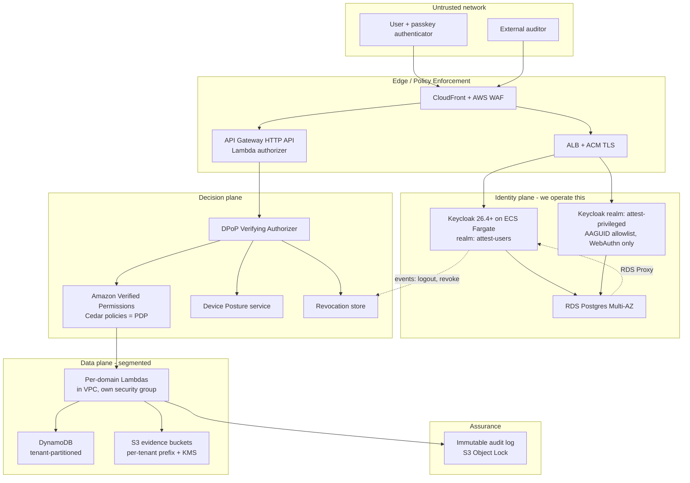
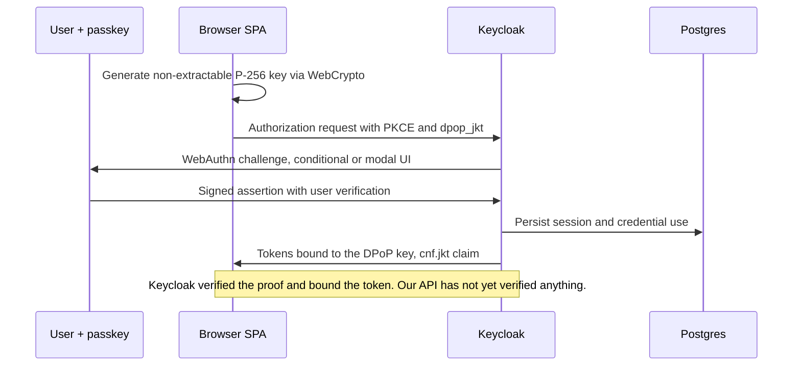

# Attest — Zero Trust Platform Plan

**Master plan.** Companion documents: [identity-and-passkeys.md](identity-and-passkeys.md),
[authorization-and-sessions.md](authorization-and-sessions.md), [threat-model.md](threat-model.md),
[decisions.md](decisions.md).

> **Revision note:** this plan originally targeted Amazon Cognito. It now targets a self-hosted
> **Keycloak** identity plane. Section 1.2 records what changed and why, and
> [decisions.md](decisions.md) ADR-001 supersedes the original identity decision.

---

## 1. Thesis

Most "Zero Trust" projects fail in one of two ways. Either they reduce to *"we turned on MFA"* —
which is not Zero Trust, it is 2004 with a better phone — or they attempt the full NIST SP 800-207
programme at once and stall at 20% without a single control in production.

This plan takes a third route: **build a real application whose data model makes Zero Trust
necessary, then implement Zero Trust as a sequence of independently shippable, independently
testable phases.** Each phase ends with a pass/fail test. No phase depends on a later phase for its
security value.

The identity foundation is passwordless FIDO2/WebAuthn via self-hosted Keycloak. That is the
strongest single control available, but Section 3 is explicit that it is roughly 30% of the work.
The rest is what actually stops lateral movement after a credential is compromised.

### 1.1 The findings that shape the design

These came from verifying the Keycloak, AWS, and NIST documentation rather than assuming it, and
they are the non-obvious content of this plan:

**(a) DPoP is officially supported in Keycloak 26.4+, which removes the biggest piece of custom
code.** DPoP binds a token to a client-held key so a stolen token is useless without the private
key. Keycloak supported it as a preview from 23.0 and made it official in 26.4
([Keycloak](https://www.keycloak.org/2025/10/dpop-support-26-4)), including binding refresh tokens
and the `dpop_jkt` authorization-request parameter.

**But the custom component does not vanish — it shrinks and moves.** Keycloak verifies the DPoP
proof at *its own* token endpoint and issues the bound token. Keycloak is **not in the request path
for our API**, so our resource server must still verify the DPoP proof on every call. What goes away
is token issuance, session storage, refresh rotation, and nonce management. What remains is a
focused **DPoP Verifying Authorizer** (Section 4.4). Stating this precisely matters, because "the IdP
handles DPoP" is a common and dangerous misreading that would leave our API accepting bound tokens
without ever checking the binding.

**(b) Keycloak realms support an acceptable-AAGUID list — the capability Cognito lacks.** Keycloak's
WebAuthn policies expose `Acceptable AAGUIDs` alongside `Authenticator Attachment`, `User
Verification Requirement`, and `Attestation Conveyance Preference`. This means device-bound
authenticator enforcement for privileged users can be **enforced at registration** rather than
approximated after the fact. Under Cognito this was an unverified heuristic (it exposed only
`AuthenticatorAttachment` and `AuthenticatorTransports`, never the AAGUID); under Keycloak it becomes
a real control. This is a **security upgrade, not just a simplification**, and it is the single
strongest argument for the switch.

**(c) Passkeys are GA in Keycloak 26.4, with the AAL logic we want already built in.** Passkeys are
supported with both conditional and modal UI, require no changes to the default browser flow, and
ship with a **"Conditional - credential"** authenticator that skips a second factor when a passkey
was used as the primary credential ([Keycloak](https://www.keycloak.org/2025/09/passkeys-support-26-4)).
That is the correct treatment of a passkey as inherently multi-factor, implemented by the IdP rather
than by us.

**(d) The cost of going OSS is operational, not financial.** Cognito's **Plus** tier provided
breached-credential blocking and risk-based adaptive authentication as managed features. **Keycloak
has no official equivalent risk engine.** We must replace it with Keycloak's built-in brute-force
detection plus a custom risk authenticator (Section 7.1, ADR-012). We also become responsible for
high availability, Postgres backups, disaster recovery, and prompt CVE patching of an
internet-facing authentication service. This is the real price of the switch and it is a
recurring engineering commitment, not a one-off setup cost.

### 1.2 What changed from the Cognito plan

| | Cognito plan | Keycloak plan |
|---|---|---|
| Token binding | Absent; custom Session Broker issued our own DPoP-bound tokens (largest risk, R2) | **Native DPoP**; a thin DPoP Verifying Authorizer remains at our API |
| Device-bound enforcement | Approximate heuristic on `AuthenticatorAttachment`/`Transports`; AAGUID unavailable | **AAGUID allowlist enforced at registration** |
| Passkeys | Paid tier; managed login v2 only | GA, conditional + modal UI, no tier gating |
| Step-up | Cryptographic verifiability was an open question | **ACR → Level of Authentication mapping** |
| Risk-based adaptive auth | Managed (Plus tier) | **Lost** — must be built (ADR-012) |
| Cost shape | Per-MAU, scales with users | Fixed compute + RDS, **independent of MAU** |
| Operational burden | AWS-operated | **We operate the IdP** |
| Identity isolation unit | User pool | Realm |

Two further consequences worth noting: realms give us the same isolation as separate user pools
(separate signing keys, separate user stores, separate WebAuthn policies), and Keycloak's federation
support makes customer SAML/OIDC federation (open question Q2 in the previous revision) nearly free
rather than a project.

---

## 2. What we are building

### 2.1 Tenants, roles, and why each role exists

Every role below exists because it creates a distinct authorization problem. Roles that do not
change the access decision were deliberately not invented.

| Role | Scope | Why it is interesting |
|---|---|---|
| **Platform Admin** | All tenants (Attest staff) | Highest privilege. Cross-tenant by job function. Requires hardware-key-only auth and break-glass. |
| **Tenant Admin** | One tenant | Manages users, billing, integrations. Can grant access — a privilege-escalation surface. |
| **Contributor** | Assigned engagements | Day-to-day user. Writes evidence. |
| **Auditor** | One engagement, read-only, time-boxed | **External third party.** Classic Zero Trust case: no VPN, no network trust, least privilege, expires automatically. |
| **Service identity** | Specific API surface | CI/CD, integrations, background jobs. Non-human. No interactive login. |

### 2.2 Assets worth protecting

Ordered by what an attacker actually wants:

1. **Cross-tenant data** — the catastrophic failure. One tenant reading another's evidence is a
   company-ending event for a compliance vendor.
2. **Platform admin capability** — the path to (1) at scale.
3. **Auditor access tokens** — externally held credentials, weakest physical control, ideal
   initial-access vector into a customer's data.
4. **Evidence integrity** — evidence that can be silently altered is worthless as a compliance
   artifact. Tamper-evidence is a product feature, not just a security control.
5. **Audit trail** — under "assume breach", the audit log is the *only* thing that tells you what
   happened. It is also the thing attackers target first.
6. **The identity provider itself** *(new under Keycloak)* — it holds every credential and mints
   every token. Compromise of the IdP is compromise of everything, and it did not exist as an asset
   when AWS ran the IdP for us.

### 2.3 Functional surface (deliberately thin)

The application needs enough substance to exercise real authorization, and no more:

- Tenant-scoped CRUD over **controls**, **evidence artifacts**, and **engagements**
- Evidence upload/download via pre-signed S3 URLs (never proxied through Lambda)
- Engagement lifecycle: create → invite auditor → auditor works → engagement closes and access
  **automatically expires**
- Tenant admin console: user management, role assignment, access review export
- Platform admin console: tenant lifecycle, break-glass, impersonation **with consent and audit**
- Immutable audit log with tenant-visible views

**Deliberately absent:** billing depth, reporting/BI, notifications beyond email, mobile apps.
These add surface area without adding security signal.

---

## 3. What "done" means

Zero Trust is not binary, and "we are Zero Trust" is not a testable claim. The project is done when
these are all true. Each maps to a phase in Section 9.

| # | Success criterion | Verified by |
|---|---|---|
| S1 | No password exists anywhere in the privileged realm, and passkey sign-in is the only interactive path for platform admins | Realm config assertion in CI + manual auth attempt |
| S2 | Sign-in resists an adversary-in-the-middle phishing proxy | Evilginx-class proxy test against our real login flow; must fail to obtain a usable session |
| S3 | A stolen access token is **not** usable from a different client | Replay a captured token without the DPoP private key; must be rejected |
| S4 | Every API request is authorized by policy, not by network position or by the mere presence of a valid token | Cedar policy coverage test: every route has a policy; unauthenticated-by-policy route fails CI |
| S5 | Cross-tenant access is blocked by at least two independent layers | IDOR/BOLA test suite attempting cross-tenant reads with a valid token from another tenant |
| S6 | Revocation takes effect in **under 60 seconds** and does not require waiting for token expiry | Automated test: revoke session → next request denied |
| S7 | Auditor access expires automatically at engagement close with no manual step | Time-travel test on engagement close |
| S8 | Every authentication and authorization decision is recorded in a tamper-evident log | Log integrity check; S3 Object Lock verified |
| S9 | No long-lived AWS credentials exist anywhere in the system | `cdk-nag` + IAM credential report; CI uses OIDC |
| S10 | The deployment is reproducible from an empty account by one command | `cdk deploy` to a clean account in CI |
| S11 | *(new)* No Keycloak instance runs a version with an unpatched critical CVE, and a patch is deployable in **under 48 hours** | Documented upgrade runbook, rehearsed at least once; version pinning verified |
| S12 | *(new)* IdP configuration is fully declarative and reproducible — no console-only changes | CI applies realm config to an empty realm and the resulting export matches expectations |

S2, S3, S5, and S6 are the criteria that separate this from a normal MFA rollout. If schedule
pressure forces cuts, cut features (Section 2.3), never these. **S11 and S12 are the criteria that
make the self-hosted IdP survivable** — without them, "we self-host Keycloak" becomes "we run an
unpatched, undocumented authentication service", which is worse than any of Cognito's limitations.

---

## 4. Reference architecture

### 4.1 Component view

Note the two distinct paths through the edge: **authentication traffic** goes to the ALB and then
Keycloak; **API traffic** goes to API Gateway where the DPoP Verifying Authorizer runs. Keeping
these separate is what lets us reason about them independently — and it is why "Keycloak does DPoP"
does not mean our API is protected.

### 4.2 Trust boundaries

The design assumes every boundary is hostile. Numbered because they are referenced throughout the
threat model.

| # | Boundary | Crossing rule |
|---|---|---|
| B1 | Internet → CloudFront | WAF rules; no trust conferred by reaching this point |
| B2 | CloudFront → ALB / API Gateway | Only our distribution; origin access control; ALB security group restricted to CloudFront |
| B3 | ALB → Keycloak | Keycloak tasks accept traffic only from the ALB security group, never directly |
| B4 | API Gateway → Lambda | **DPoP proof and policy decision must both pass**; a valid token alone is never sufficient |
| B5 | Lambda → DynamoDB / S3 | IAM least privilege per function; tenant scope enforced in the request, not just the role |
| B6 | Tenant ↔ tenant | Enforced independently in Cedar policy and in the data-access layer |
| B7 | `attest-users` realm ↔ `attest-privileged` realm | Separate realms, signing keys, and WebAuthn policies. No credential, session, or trust relationship crosses |
| B8 | Human ↔ workload identity | Different mechanisms entirely (passkey vs OIDC/mTLS); no shared secrets |
| B9 | *(new)* Our code ↔ Keycloak administration | Admin API access is a privileged, audited operation; realm config is declarative (S12), so no human has routine admin need |

### 4.3 PDP / PEP separation

This table is the operational definition of Zero Trust in this system. Every access decision has
one policy authority and one or more enforcement points, and they are never the same component.

| Decision | PDP (decides) | PEP (enforces) | Not sufficient alone |
|---|---|---|---|
| Is this token authentic and unexpired, and DPoP-bound? | Keycloak (issues + signs) | DPoP Verifying Authorizer | Keycloak verifies the binding at *issuance*; it cannot verify our API's requests |
| Is this request accompanied by the private key? | DPoP proof verification | DPoP Verifying Authorizer | This is the anti-token-theft control (S3) |
| Is the session still active, or revoked? | Revocation store | DPoP Verifying Authorizer + per-request check | Token expiry is too slow (S6) |
| Is this principal allowed to do this action on this resource in this tenant? | Amazon Verified Permissions (Cedar) | Lambda integration | Network position and tenant claim are not authorization |
| Is this device acceptable for this action? | Device Posture service | Verifier + Cedar context | Fed into policy as context, not a separate gate |
| Should this tenant see this row at all? | Cedar + data layer | DynamoDB access layer | Defence in depth for S5; either layer alone is a single point of failure |

### 4.4 Request lifecycle

**Sign-in (once, then session refresh):**

**Every subsequent API call** runs this gauntlet, and all of it must pass:

1. CloudFront/WAF — volumetric and signature filtering (B1)
2. API Gateway — TLS, routing, throttling
3. **DPoP Verifying Authorizer** — JWT signature via Keycloak JWKS, `cnf.jkt` present, DPoP proof
   signature matches the thumbprint, `htm`/`htu` match the request, `jti` not replayed, `iat` fresh
   (S3)
4. Revocation check — session not revoked (S6)
5. Posture gate — posture score satisfies the requested action's requirement
6. AVP `IsAuthorized` — Cedar policy for principal/action/resource/context (S4)
7. Data layer — tenant scope re-applied in the query itself (S5)
8. Audit — decision recorded asynchronously, non-blocking

Steps 3–7 are each independently capable of denying the request. That redundancy is intentional:
any one of them failing is a security incident, not an outage, so they must not share a fate.

---

## 5. The identity plane (summary)

Full detail in [identity-and-passkeys.md](identity-and-passkeys.md).

- **Two realms, two assurance levels.** `attest-users` for customers (passkey + password coexistence
  during migration). `attest-privileged` for Attest staff, with **no password authenticator
  configured at all** (S1) and a restrictive WebAuthn policy.
- **AAGUID allowlist on the privileged realm.** Device-bound authenticators are enforced at
  registration, not inferred after the fact. This is the capability that Cognito could not provide.
- **`User Verification Requirement = Required`** on the privileged realm, `Preferred` on the
  standard realm.
- **Native passkeys with conditional UI.** The **"Conditional - credential"** authenticator skips a
  second factor when a passkey was the primary credential — the IdP implements the correct AAL
  reasoning rather than us approximating it.
- **DPoP required on both realms' clients**, binding access and refresh tokens.
- **ACR → Level of Authentication mapping** for step-up, so elevation is standards-based
  (`acr_values`) rather than a custom timestamp.
- **Recovery is designed as an attack surface, not a support workflow.** Section 8 of the identity
  document specifies recovery that cannot downgrade below the assurance of the factor it replaces.

## 6. The authorization plane (summary)

Full detail in [authorization-and-sessions.md](authorization-and-sessions.md).

- **Two-layer authorization, both required.** The DPoP Verifying Authorizer answers "is this session
  trustworthy and live?"; AVP answers "may this principal do this, to this resource, in this tenant,
  *right now*?". Authorization is never inferred from the tenant claim alone.
- **Cedar via Amazon Verified Permissions is retained** (ADR-005). Keycloak's own Authorization
  Services (UMA) were rejected: its policy model is weaker for per-resource tenant isolation, and we
  already have a strong, auditable, CI-gated Cedar design. This is deliberately the one part of the
  original plan that does not change.
- **Policies are code.** Cedar policies live in the repo, are validated in CI, and every API route
  must have a corresponding policy or the build fails (S4).
- **Revocation is a first-class subsystem.** Keycloak provides session revocation and admin logout;
  we add an event listener that publishes revocation events so the effect is visible to our API in
  under 60 seconds (S6, Spike #8).

## 7. Continuous verification and device posture

This is the pillar most often skipped, and the one that makes the difference between "Zero Trust"
and "strong login". Two honest constraints:

1. **Browser posture is weak evidence.** A web app cannot attest to the health of the device it
   runs on. Anything claimed by JavaScript is attacker-controlled. Phase 4 therefore uses
   *server-observable* signals (TLS/JA4 fingerprint, IP/ASN reputation, coarse geolocation drift,
   WebAuthn authenticator properties from Keycloak) and treats client-reported signals as untrusted
   hints only.
2. **Real posture requires an agent.** Genuine device attestation needs MDM enrolment or a device
   agent reporting TPM/Secure Enclave state. That is Phase 4b, gated on customer demand, and is
   explicitly **not** a Phase 1–3 dependency.

Posture is not a separate gate — it is **input to the policy decision**. A low posture score does
not necessarily deny; it raises the required assurance for sensitive actions, forcing step-up. That
is what "continuous" means in practice.

### 7.1 Replacing managed threat protection (new workstream)

Cognito Plus supplied breached-credential blocking and risk-based adaptive authentication. Keycloak
supplies neither, so Phase 4 must build the substitute (ADR-012):

| Capability lost | Replacement | Notes |
|---|---|---|
| Breached-credential blocking | Custom Keycloak **Authenticator SPI** checking a breached-password corpus at registration and change | Only relevant to the standard realm; the privileged realm has no passwords at all, so this loss is largely self-mitigating |
| Device/network risk signals | Custom **Conditional** authenticator calling our Risk service, forcing step-up via `acr_values` or denying | Java SPI work — the main added build cost of the OSS route |
| Brute-force protection | Keycloak built-in brute-force detection, tuned strictly | Native; must be explicitly enabled and tuned |
| Threat telemetry | Keycloak event listener → CloudWatch/EventBridge → detection rules | Native event system gives us more raw signal than Cognito Plus did |

The last row is the consolation prize, and it is real: Keycloak's event system exposes more
authentication detail than Cognito's managed threat protection did, so detection can end up
*better* even though the managed risk scoring was better. Both statements are true.

## 8. Microsegmentation and workload identity

- **Per-domain Lambdas with their own IAM roles and security groups.** The evidence-upload function
  cannot read the audit table. No shared "app role" — that is the single most common AWS
  segmentation failure.
- **Keycloak tasks accept traffic only from the ALB security group.** No direct access, no public
  task IPs, tasks in private subnets.
- **RDS Postgres in private subnets, Multi-AZ, encrypted**, reached via RDS Proxy so Fargate task
  churn does not exhaust connections. Credentials in Secrets Manager with rotation.
- **DynamoDB tenant partitioning** with point-in-time recovery; tenant scope enforced in the request
  path, and separately by IAM condition keys where the data model allows.
- **S3 evidence buckets**: per-tenant prefixes, KMS CMK, access only via pre-signed URLs, Object Lock
  on the audit bucket.
- **No long-lived AWS credentials** (S9). CI authenticates via GitHub OIDC → IAM role. Service
  identities use Keycloak client credentials for our own API and SigV4 for AWS APIs.
- **Human access to AWS is via IAM Identity Center with FIDO2 security keys** — no exceptions,
  because the AWS management plane is the true crown jewel and it is outside Keycloak entirely.
- **VPC endpoints** for DynamoDB/S3/KMS/Secrets Manager so data access does not traverse the public
  internet.

## 9. Phased delivery

Ordering principle: **each phase is independently valuable and independently testable.** If the
project stops after Phase 3, the result is still a genuinely defensible Zero Trust application.

### Phase 0 — Foundations
**Deliverable:** CDK app, CI with OIDC, `cdk-nag` in CI, Keycloak ECS + RDS + ALB stack, declarative
realm configuration pipeline, clean-account deploy.
**Acceptance:** `cdk deploy` succeeds from empty account (S10); realm config applies to an empty
realm reproducibly (S12); `cdk-nag` passes with no unsuppressed findings; no static AWS credentials
(S9).
**Blocked on:** `aws login`, Docker running, resolving the pnpm/corepack issue.
**Note:** Keycloak clustering on Fargate (Spike #7) must be resolved here — a single-task Keycloak
is not a viable production target.

### Phase 1 — Passwordless identity
**Deliverable:** both realms, passkeys enrolled and working, WebAuthn policies, AAGUID allowlist,
`direct` attestation on the privileged realm, **and a modified browser flow that removes the password
authenticator from `attest-privileged`**.
**Acceptance:** register and sign in with a passkey on the standard realm; **prove no password
authenticator exists** on the privileged realm (S1); a non-allowlisted authenticator is **rejected at
registration** on the privileged realm; Evilginx-class proxy test fails to capture a usable session
(S2).

> **Scope correction from Spike #3:** S1 is **not** achieved by realm configuration. Keycloak's
> default browser flow sets `Username Password Form` to `REQUIRED`, and
> `webauthn-authenticator-passwordless` is **not in the default flow at all**. During the spike a
> password login to `attest-privileged` *succeeded*. Removing the password factor is genuine flow
> surgery (copy the browser flow, drop the password form, wire the passkey authenticator, bind it to
> the realm) and must be built and regression-tested — see
> [SPIKE-3-RESULTS.md §5](../lab/keycloak/SPIKE-3-RESULTS.md). Budget for it; do not assume a
> toggle.
**This phase delivers the headline requirement.** It does not yet satisfy S3 — Keycloak binds the
token, but our API is not yet verifying proofs.

### Phase 2 — DPoP verification at our API
**Deliverable:** DPoP Verifying Authorizer replacing the plain JWT authorizer; revocation store and
event-driven invalidation.
**Acceptance:** token replay without the private key is rejected (S3); revocation propagates in under
60s (S6).
**Much smaller than the original Phase 2** (which built a token-issuing broker from scratch). The
remaining risk is integration correctness, not novel cryptography — see Spikes #1 and #8.

### Phase 3 — Fine-grained authorization
**Deliverable:** AVP/Cedar policies, tenant isolation in Cedar *and* the data layer, auditor
scoping, admin consoles, policy-coverage CI gate.
**Acceptance:** cross-tenant IDOR suite fails to breach (S5); every route has a policy (S4); auditor
access auto-expires at engagement close (S7).

### Phase 4 — Continuous verification and risk
**Deliverable:** posture service, server-side signals, ACR-based step-up, custom risk authenticator,
breached-password authenticator, tuned brute-force detection.
**Acceptance:** a degraded posture triggers step-up rather than silent access; step-up is
`acr_values`-driven and verifiable; the replacement controls in Section 7.1 demonstrably cover the
capabilities lost from Cognito Plus.

### Phase 5 — Segmentation and workload identity
**Deliverable:** per-function IAM and security groups, VPC endpoints, OIDC CI, service identities,
RDS Proxy, secrets rotation.
**Acceptance:** evidence-upload function provably cannot read the audit table; no long-lived keys.

### Phase 6 — Assurance and operations
**Deliverable:** immutable audit pipeline, detection rules, **Keycloak upgrade and DR runbook**,
ZTMM self-assessment, red-team exercise.
**Acceptance:** audit log tamper-evident (S8); the upgrade runbook is rehearsed and a patch is
deployable within 48 hours (S11); red team cannot reach cross-tenant data or platform admin within
the agreed time box.

**Phase 6 is materially heavier than in the Cognito plan.** Running the IdP means version upgrades,
Postgres failover drills, and restore testing are ongoing obligations, not one-time deliverables.

---

## 10. Non-goals

Recorded so they can be renegotiated deliberately rather than drifted into.

- **Building our own FIDO2/WebAuthn server.** Rejected — ADR-001. We run Keycloak; we do not
  reimplement it.
- **Becoming an identity product.** We operate an IdP for *our* application. We are not offering
  IdP-as-a-service, multi-tenant IdP isolation for customers, or BYO-IdP hosting.
- **Multi-region active-active Keycloak.** Phase 6 targets a rehearsed restore and a single-region
  Multi-AZ deployment. Active-active across regions is a much larger project and is out of scope
  until a contractual requirement exists.
- **A custom Keycloak theme beyond basic branding.** Cosmetic work with real upgrade cost (themes
  break across versions). Use stock login screens.
- **Forking Keycloak.** Extensions only, via documented SPIs. A fork makes CVE patching (S11)
  unbounded.
- **Client-side malware and malicious browser extensions.** Out of scope. A hostile extension that
  shares the browser context defeats DPoP in practice. We reduce but do not eliminate this; the
  threat model says so explicitly.
- **Physical coercion / evil-maid attacks.** Out of scope for this application's risk profile.
- **Being the identity provider for a customer's other systems.** Attest is a relying party for our
  own app. Federation *in* (customer SAML/OIDC) is now cheap with Keycloak and is a plausible later
  feature; federation *out* is not.
- **Full network microsegmentation of a corporate estate.** We segment our own AWS workload.
- **Formal certification.** This plan maps to NIST SP 800-207 / 800-63B-4, OMB M-22-09, and CISA
  ZTMM, but mapping is not certification, and no auditor has reviewed it.
- **A device agent and MDM integration** (Phase 4b) — deferred, gated on demand.

## 11. Cost model

The cost shape changed fundamentally. Cognito was **per-MAU**; Keycloak is **fixed compute**,
independent of user count. That inverts the economics: more expensive at low volume, cheaper at
high volume, and — the underrated benefit — **fully predictable**, which matters more for planning
than either.

I could not extract current Cognito unit prices during the original planning pass, and I have not
priced Keycloak hosting either. Rather than invent numbers, here are the drivers.

| Cost driver | Scaling dimension | Notes |
|---|---|---|
| RDS Postgres Multi-AZ | **Fixed, dominant** | The largest single line item. Sized by realm/user count, not request rate. Multi-AZ roughly doubles instance cost. |
| ECS Fargate tasks | Fixed (task count) | Minimum 2 tasks for availability, plus autoscaling headroom for login bursts. |
| ALB | Fixed + LCU | One ALB, or shared with other services. |
| NAT Gateway | Fixed + data | Needed for private-subnet egress. |
| CloudFront + WAF | Requests + rule count | Managed rule groups are a meaningful fixed monthly cost. |
| API Gateway / Lambda | Request volume | DPoP verification runs per request — keep the authorizer lean, and cache JWKS. |
| Amazon Verified Permissions | API calls + policies | Retained from the original plan. |
| DynamoDB / S3 | Storage + requests | Evidence storage dominates, not auth. |
| KMS + S3 Object Lock | Keys + storage | Object Lock storage grows monotonically — model retention deliberately. |
| CloudWatch / audit retention | Log volume | Keycloak emits substantial event volume. Tier aggressively, but never drop authz decisions (S8). |
| **Engineering time** | **Recurring** | The real cost of self-hosting: upgrades, patching, DR drills, incident response. Budget it explicitly or it becomes invisible and then becomes an outage. |

**Action before Phase 0:** price RDS Multi-AZ, Fargate, ALB, and NAT for the target region, and
record live Cognito-equivalent figures for comparison. Treat every number above as `VERIFY`. The
break-even question — "at what MAU is self-hosted Keycloak cheaper than Cognito Essentials/Plus?" —
cannot be answered without those figures.

## 12. Risk register

| # | Risk | Impact | Likelihood | Mitigation |
|---|---|---|---|---|
| R1 | **We operate the IdP.** Unpatched Keycloak CVE, failed upgrade, or DB outage takes authentication down or compromises it | Critical | Medium | Version pinning + 48-hour patch SLA (S11), rehearsed upgrade runbook, automated Postgres backups with tested restore, Multi-AZ, managed-Keycloak fallback documented (ADR-010) |
| R2 | Misreading "Keycloak does DPoP" and never verifying proofs at our API | Critical | **Medium-High** | DPoP Verifying Authorizer is an explicit Phase 2 deliverable with a replay test (S3); ADR-004 states the boundary in bold |
| R3 | Keycloak clustering on Fargate (no Kubernetes DNS) is misconfigured, causing session loss or split brain | High | Medium | Spike #7; jdbc-ping discovery; verify before Phase 1 |
| R4 | Loss of managed adaptive auth degrades risk detection versus Cognito Plus | High | Medium-High | ADR-012 replacement workstream in Phase 4; Keycloak's richer event stream partly compensates |
| R5 | Realm configuration drifts from code (console changes) and becomes unreproducible | High | Medium | Declarative config in CI (S12); admin access restricted and audited (B9) |
| R6 | Custom Keycloak SPIs (risk, breached-password authenticators) break on upgrade | Medium | High | Extensions only, no fork; pin versions; upgrade runbook includes SPI compatibility check |
| R7 | Recovery flow becomes the weakest link and re-opens phishing | High | Medium-High | Recovery designed in Section 8 of the identity doc; admin-assisted with identity proofing, never email-OTP-only |
| R8 | Cedar policy sprawl becomes unmaintainable | Medium | Medium | Policy-as-code, coverage gate in CI, templates plus per-tenant overrides |
| R9 | Two realms create a confusing duplicate-identity experience for staff | Low | High | Accept it; staff are few and the separation is the point (ADR-002) |
| R10 | Scope creep toward the non-goals in Section 10 | High | High | Section 10 exists to be cited in review. Still the most likely way the project fails |
| R11 | RDS becomes a single point of failure or a bottleneck under login bursts | High | Low-Medium | Multi-AZ, RDS Proxy, connection pooling tuned, load test in Phase 6 |

## 13. Compliance mapping

Mapping, not certification. Useful for framing, not as evidence.

| Framework | What it demands | Where addressed |
|---|---|---|
| NIST SP 800-207 (Zero Trust Architecture) | PDP/PEP separation; per-request decisions; assume-breach posture | Sections 4.3, 4.4, 6 |
| NIST SP 800-63B-4 / 800-63Bsup1 | Phishing-resistant authenticators; treatment of syncable authenticators | identity-and-passkeys.md, ADR-003 |
| OMB M-22-09 | Phishing-resistant MFA; no password-only fallback for privileged users | Phase 1 acceptance (S1) |
| CISA Zero Trust Maturity Model | Five pillars: identity, devices, networks, applications, data | Phases 1–6 map roughly one per pillar |
| SOC 2 (as a product feature) | Access control, change management, monitoring, evidence integrity | Audit pipeline (Phase 6), Object Lock, CI policy gates |
| NIST IR 8587 (token protection) | Sender-constrained tokens, replay resistance | DPoP (Phase 2), Spike #1 |

---

## 14. Immediate next actions

1. **Run `aws login`** and confirm target account + region. Everything downstream is blocked.
2. **Review the 8 verification spikes** in [decisions.md](decisions.md). #1 (DPoP end-to-end) and #7
   (Fargate clustering) are the two most likely to force a design change.
3. **Confirm Section 10 (non-goals)** — particularly "no multi-region active-active" and "no custom
   theming". Both are commonly discovered later as implicit requirements.
4. **Confirm Section 3 success criteria**, especially the two new ones (S11, S12). If the team is not
   prepared to commit to a 48-hour IdP patch SLA, self-hosting Keycloak is the wrong choice, and it
   is far cheaper to discover that now than in production.
5. **Resolve the pnpm/corepack issue** and confirm Docker is running.
6. On approval: Phase 0, then Phase 1.
