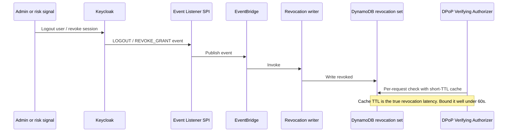

# Authorization and Session Hardening (Keycloak + DPoP)

How Attest turns a valid sign-in into a continuously verified, sender-constrained, policy-authorized
session. Companion to [PLAN.md](PLAN.md) and [identity-and-passkeys.md](identity-and-passkeys.md).

---

## 1. What Keycloak solves, and what it does not

Moving to Keycloak removed the largest piece of custom code from the original plan, but it did not
remove the security problem. Understanding the boundary precisely is the difference between a real
control and a checklist item.

**What Keycloak does:**

- Verifies the DPoP proof presented at **its own token endpoint**
- Issues tokens carrying `cnf.jkt` — the SHA-256 JWK thumbprint of the client's public key
- Binds both access and refresh tokens (configurable per client)
- Supports `dpop_jkt` on the authorization request to bind from the start
- Issues and rotates refresh tokens, manages sessions, and can revoke them

**What Keycloak cannot do:**

- Verify DPoP proofs on requests to **our** API. Keycloak is not in that request path.
- Tell our API that a session was revoked, unless we listen for its events.

> **The failure mode to avoid:** an engineer reads "Keycloak supports DPoP", enables
> *Require DPoP bound tokens* on the client, sees `cnf.jkt` in the token, and considers token theft
> solved. It is not. Without resource-server verification, our API accepts a stolen access token
> from anywhere — the token merely *advertises* a binding nobody checks. This is worse than not
> having DPoP, because it creates false confidence. **Phase 2 exists to close exactly this gap**
> (ADR-004).

So the custom component shrinks from a token-issuing Session Broker to a focused **DPoP Verifying
Authorizer**. Smaller and far less novel — but not zero, and risk R2 tracks the misreading above.

---

## 2. Authorization layers

Neither layer is sufficient alone, and that is the point.

```text
Request
  │
  ├─ Layer 1 — DPoP Verifying Authorizer   (SESSION INTEGRITY)
  │    JWT signature via Keycloak JWKS · cnf.jkt present · DPoP proof valid ·
  │    htm/htu match · jti not replayed · iat fresh · session not revoked
  │    Answers: "is this the client the token was issued to, and is it still live?"
  │
  └─ Layer 2 — Amazon Verified Permissions (FINE-GRAINED)
       May THIS principal perform THIS action on THIS resource in THIS tenant,
       given current context?
       Answers the only question that actually matters.
```

**A common and serious mistake:** treating token validity as authorization. A valid, DPoP-bound JWT
proves the caller holds a key; it says nothing about entitlement. Authorization is always a separate
decision, and in this architecture it is always made by Cedar.

---

## 3. The DPoP Verifying Authorizer

### 3.1 Responsibilities

A single API Gateway **Lambda authorizer**, deliberately narrow:

1. Fetch and cache Keycloak JWKS; verify the token signature and standard claims (`iss`, `exp`,
   `aud`/`azp`, `typ`)
2. Require `cnf.jkt` to be present — **reject unbound tokens outright**, so a client that forgets
   DPoP cannot silently fall back to bearer
3. Verify the DPoP proof: signature against the embedded `jwk`, thumbprint equals `cnf.jkt`
4. Verify `htm`/`htu` match the actual request, `iat` is fresh, `jti` is not replayed
5. Check the session against the revocation store
6. Return principal + context (tenant, assurance, `acr`, posture) for the integration to pass to AVP

It does **not** make fine-grained authorization decisions. Keeping it narrow keeps it reviewable, and
reviewable security-critical code is the whole point.

### 3.2 DPoP proof verification

The proof is a JWT presented alongside the access token:

| Part | Value | Verified how |
|---|---|---|
| Header `typ` | `dpop+jwt` | Must match exactly |
| Header `jwk` | Client public key | RFC 7638 thumbprint must equal `cnf.jkt` |
| Claim `htm` | HTTP method | Must equal the actual request method |
| Claim `htu` | HTTP URI | Must equal the actual request URI **after normalisation** |
| Claim `iat` | Issued-at | Within a small window (± few seconds) |
| Claim `jti` | Unique ID | Must not be in the replay cache |
| Claim `nonce` | Server-issued nonce | Must match the current nonce, if nonce mode is used |
| Signature | ES256 | Must verify against `jwk` |

**Implementation details that decide whether this actually works:**

- **URI normalisation is the classic DPoP bug.** `htu` must be compared after normalising scheme,
  host, port, path, and query per RFC 9449. Compare naively and you either reject valid requests
  (breaking the API) or accept mismatched ones (breaking the security). Write this once, in one
  place, with a test table — never inline in a handler.
- **The `jti` replay cache is what makes this real.** A DynamoDB table with TTL equal to the accepted
  `iat` window, keyed by thumbprint + `jti`. Skipping it turns DPoP into theatre.
- **Nonce support.** Keycloak issues `DPoP-Nonce` challenges. Decide whether our API uses nonces
  too; it narrows the replay window further at the cost of a round trip on first use. If we skip
  nonces, the `jti` cache becomes the only replay defence, so it must be correct.
- **Clock skew** must be explicit and small. A generous window widens the replay window.
- **JWKS caching** with a sane TTL and a forced refresh on unknown `kid` — Keycloak signs with a
  realm key, and realm key rotation must not become an outage.
- **The `iss` claim must match the configured Keycloak hostname.** This is the single most common
  self-hosted Keycloak misconfiguration behind a reverse proxy: the issuer reflects an internal
  hostname, and every token fails validation with a confusing mismatch. Verify it once in Phase 0
  and assert it in a test.

### 3.3 Browser-side key handling

```ts
// Non-extractable: the private key cannot be read by JavaScript, even by XSS.
const keyPair = await crypto.subtle.generateKey(
  { name: 'ECDSA', namedCurve: 'P-256' },
  false,                                    // extractable = FALSE
  ['sign', 'verify'],
);

// CryptoKey objects are structured-cloneable and survive in IndexedDB.
const db = await openDB();
await db.put('dpop', keyPair.privateKey, 'current');
```

`extractable: false` is the property that makes this worth doing: JavaScript — including injected
JavaScript — can *use* the key but cannot *export* it. That converts "steal the token" into "steal
the token and also run code in the same origin, in the same browser profile, at the same time".

### 3.4 Honest limits of DPoP

| Attack | DPoP effect |
|---|---|
| Token stolen from a log or proxy | **Defeated** — no private key |
| Token replayed from a different machine | **Defeated** — proof signature fails |
| Token stolen via XSS | **Only partially mitigated** — the attacker's script runs in the origin and can *use* the non-extractable key |
| Malicious browser extension | **Not mitigated** — shares the browser's origin context |
| User's device fully compromised | **Not mitigated** |

This is exactly why Phase 4 posture and short TTLs still matter. DPoP removes a whole class of
token-theft attacks; it does not remove the need for defence in depth, and the threat model says so
rather than implying the problem is solved.

### 3.5 Session artifact matrix

Keycloak defaults are shown; the values we adopt are in bold.

| Artifact | Issuer | TTL | Storage | Bound to |
|---|---|---|---|---|
| Access token | Keycloak | Default 5 min (**keep 5 min**) | Memory only, never `localStorage` | DPoP key (`cnf.jkt`) |
| ID token | Keycloak | 5 min | Memory | DPoP key |
| Refresh token | Keycloak | SSO idle 30 min / max 10 h (**tighten for privileged realm**) | `HttpOnly`, `Secure`, `SameSite` cookie | DPoP key |
| DPoP private key | Browser WebCrypto | Persistent | IndexedDB, non-extractable | — |
| Step-up elevation | Keycloak | Carried as `acr` in the token | — | Bounded by policy freshness check |

**Refresh tokens never go in `localStorage`.** It is readable by any injected script, which makes it
the single highest-value XSS target in the app. Use a secure cookie, and enable refresh-token
rotation. For the privileged realm, tighten SSO idle and max session lifetimes well below the
defaults — staff can tolerate re-authenticating more often than customers can.

---

## 4. Fine-grained authorization with Cedar

### 4.1 Why AVP/Cedar is retained

Keycloak ships its own Authorization Services (UMA 2.0). We are **not** using it (ADR-005):

- Its policy model is weaker for per-resource, per-tenant isolation — the exact thing we cannot get
  wrong.
- Cedar was designed for formal analysis, which is what a tenant-isolation boundary deserves.
- We already have a strong design: policies as code, a CI coverage gate, and an auditable
  decision log.
- Decoupling the PDP from the IdP means an IdP migration does not rewrite authorization.

**Caveat (Spike #2):** `IsAuthorizedWithToken` accepts tokens from supported OIDC providers. Whether
it accepts a **Keycloak-issued** token directly, or whether we must call `IsAuthorized` with an
explicit principal built from verified claims, must be confirmed before Phase 3. This is the same
question the Cognito plan had, and it is unresolved either way.

### 4.2 Entity model

```text
Principals:  User, ServiceIdentity
Actions:     ReadEvidence, WriteEvidence, DeleteEvidence, InviteAuditor,
             ManageUsers, ExportAccessReport, CrossTenantView, ImpersonateUser
Resources:   Tenant, Engagement, Evidence, Control, User, AuditLog
Context:     posture_score, ip_reputation, step_up_age_seconds, acr,
             request_time, assurance
```

### 4.3 Policies

Tenant isolation is the load-bearing policy and is written to **fail closed**: if no `permit`
matches, the request is denied.

```cedar
// Baseline: no cross-tenant access, ever. A FORBID, so no later permit can override it.
forbid (
  principal,
  action,
  resource
)
when {
  principal has tenant_id &&
  resource has tenant_id &&
  principal.tenant_id != resource.tenant_id
};

// Contributors and tenant admins may read evidence in their own tenant.
permit (
  principal,
  action == Action::"ReadEvidence",
  resource is Evidence
)
when {
  principal.tenant_id == resource.tenant_id &&
  principal.role in [Role::"Contributor", Role::"TenantAdmin"]
};
```

The `forbid` is deliberate: in Cedar, `forbid` always wins over `permit`. Writing tenant isolation
as a `forbid` means a future developer cannot accidentally grant cross-tenant access by adding a
broad `permit`. **Do not rewrite this as a `when` clause on the permits** — that restores the
failure mode where one careless new policy opens the boundary.

Auditor access is scoped to an engagement and expires on its own:

```cedar
permit (
  principal is User,
  action in [Action::"ReadEvidence", Action::"ReadControl"],
  resource is Evidence
)
when {
  principal.role == Role::"Auditor" &&
  principal.tenant_id == resource.tenant_id &&
  resource.engagement_id in principal.engagement_ids &&
  context.request_time < principal.access_expires_at
};
```

Platform admins get **no blanket permit**. Cross-tenant access is a distinct, heavily-audited action,
and it now reads the `acr` value that Keycloak's ACR/LoA mapping produces:

```cedar
permit (
  principal,
  action == Action::"CrossTenantView",
  resource
)
when {
  principal.role == Role::"PlatformAdmin" &&
  context.acr == "attest:hardware" &&          // Keycloak LoA, set by ACR mapping
  context.step_up_age_seconds < 300 &&          // freshness bounded in policy, not UI
  context.justification_recorded == true
};
```

Note both conditions. `acr` proves *how* they authenticated; `step_up_age_seconds` proves *when*.
Requiring only `acr` would leave an elevated token valid for the rest of the session.

### 4.4 Policy-as-code with a coverage gate

Policies live in the repository and are validated in CI. **Every API route must map to at least one
policy, or the build fails** (S4).

```text
CI gates:
  1. cedar validate          -> syntax and schema conformance
  2. policy coverage check   -> every route in the route manifest has a policy
  3. forbid-conflict check   -> a forbid must not make a required route unreachable
  4. integration test suite  -> allow/deny matrix per role, executed against AVP
```

Gate 3 matters as much as gate 2: an over-broad `forbid` can silently lock out legitimate users, and
the symptom (a 403 in production) would otherwise be discovered by a customer.

### 4.5 Tenant isolation — defence in depth

Cedar is one layer. Success criterion S5 requires **two independent layers**, because a single Cedar
policy error would otherwise be a cross-tenant breach.

| Layer | Mechanism | Fails how |
|---|---|---|
| L1 — Policy | Cedar `forbid` on tenant mismatch | Miswritten policy |
| L2 — Data access | Every DynamoDB query keyed by `tenant_id` from verified token claims, never from request input | Developer error |
| L3 — IAM | Where applicable, IAM condition keys scoping access to the tenant prefix | Misconfigured role |
| L4 — Tests | Cross-tenant IDOR/BOLA suite run in CI on every change | Test gap |

**The single rule that prevents most tenant-isolation bugs:** the tenant ID comes from the
cryptographically verified token and is **never** read from a request body, query string, or path
parameter. Any code path that accepts a tenant ID from input is a bug by definition, and L4 exists to
find it.

---

## 5. Revocation

Success criterion S6 requires revocation to take effect in **under 60 seconds**. Our authorizer
validates JWTs statelessly, so it will never notice a revocation on its own — token expiry alone is
far too slow, and Keycloak revoking its own session does not automatically inform our API.

**Design: Keycloak events → revocation store → per-request check.**



```text
Revocation set (DynamoDB, read-through cached):
  pk: revoked#session#<sid>   OR   revoked#user#<sub>
  reason, revoked_at, revoked_by
  ttl: <original token expiry>   -> entry need only outlive the token it kills
```

**Revocation triggers — all of them invalidate immediately, not at next expiry:**

| Trigger | Scope | Source |
|---|---|---|
| Passkey deleted from account | All sessions for that user | Keycloak admin/user event |
| New passkey enrolled (possible compromise) | All *other* sessions | Keycloak credential event |
| Posture degrades below threshold | That session | Posture service |
| Risk signal (impossible travel, bad ASN) | That session | Risk service |
| Admin revokes user | All sessions for that user | Keycloak admin REST / event |
| Tenant offboarding / engagement close | All sessions for that tenant / engagement | Lifecycle handler |
| **DPoP proof failure** | That session, **and alert** | DPoP Verifying Authorizer |

That last row is worth emphasising: **a DPoP proof failure is a detection signal, not just a rejected
request.** It means someone holds a token without the key. That is a high-confidence token-theft
indicator and should page, not just 401.

**Keycloak primitives we build on:** admin-initiated user logout, session revocation, the RFC 7009
token revocation endpoint, and short access-token lifespans. The **Event Listener SPI** is the piece
that connects Keycloak's state to ours, and it is the reason this is a spike (#8) rather than an
assumption.

**The cache is the latency.** A read-through cache introduced for performance silently becomes the
revocation SLA. State the cache TTL explicitly in the runbook and assert it in a test; do not let it
drift upward over time.

---

## 6. Machine identity

Non-human identities are where Zero Trust projects most often quietly give up and use a long-lived
API key. Attest does not.

| Consumer | Mechanism | Lifetime |
|---|---|---|
| CI/CD deploying infra | GitHub OIDC → IAM role assumption | Per-job, minutes |
| Internal service → internal service | IAM SigV4 (same account) | Per-request |
| Customer integration → Attest API | Keycloak client credentials, scoped | Short, rotated |
| Third party → Attest API | Client credentials with **`private_key_jwt` or mTLS** | Short, rotated |
| Lambda → AWS services | IAM execution role | Per-invocation |

**Rules:**

- **No long-lived AWS access keys anywhere** (S9). `cdk-nag` enforces it and a credential report
  check runs in CI.
- **Prefer asymmetric client authentication over client secrets.** Keycloak supports
  `private_key_jwt` and mTLS client authentication. A client secret is a shared bearer credential;
  a private key is not. Use secrets only where a third party genuinely cannot do better.
- **Service identities are first-class principals in Cedar**, with their own actions and resources.
  They are not "a user with a flag".
- **A service identity can never hold a human role.** The `ServiceIdentity` principal type cannot
  match `Role::"PlatformAdmin"` — enforced by the entity model, not by convention.
- **Every customer integration gets its own client**, so revocation is per-customer rather than
  global.

---

## 7. Verification spikes owned by this document

Spikes #1, #2, #4, and #8 in [decisions.md](decisions.md). Summarised:

1. **DPoP end-to-end** (#1) — Keycloak issues a `cnf.jkt` token; our authorizer verifies proofs
   through ALB → API Gateway → Lambda; the `DPoP` header survives every hop unmodified. **Run this
   first** — header stripping would break binding silently.
2. **AVP with Keycloak tokens** (#2) — `IsAuthorizedWithToken` with a Keycloak token, or
   `IsAuthorized` with an explicit principal? Determines the Phase 3 integration shape.
3. **Browser key persistence** (#4) — non-extractable `CryptoKey` survival in IndexedDB across
   Safari, Chrome, and Firefox. Safari is historically the difficult one.
4. **Revocation latency** (#8) — the event listener → EventBridge → DynamoDB path genuinely delivers
   under 60 seconds, including the cache TTL.

---

## 8. What this buys, in one table

| Control | Without it | With it |
|---|---|---|
| Passkeys | Phishable credentials | Phishing-resistant login |
| AAGUID allowlist | Synced passkey counts as privilege | Device-bound hardware authenticator enforced at registration |
| DPoP at the IdP | Bearer tokens minted | Tokens bound to a client key at issuance |
| **DPoP at our API** | **Binding advertised but unchecked** | Stolen token is inert without the key |
| Short TTL + revocation events | Compromise valid for hours | Revocation in < 60s |
| Cedar policy | Valid token ≈ full access | Per-action, per-resource entitlement |
| Tenant `forbid` | One policy bug = cross-tenant breach | Fail-closed boundary |
| ACR step-up | Elevation is a UI gesture | IdP-issued, token-carried elevation with policy-bounded freshness |
| Machine identity | Long-lived keys in CI | Short-lived, scoped, per-integration |
